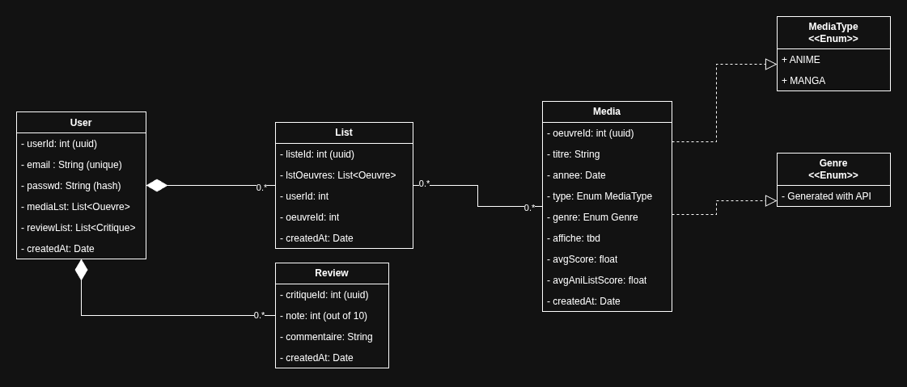

# TP1-Service-Web

Sujet: Evaluation d'oeuvre d'art

Enonce: https://laboratoire-1-service-web-25604.vercel.app/index.html

## Separation du travail

- Axios (JS)
- Express (JS)
- Prisma + Neon (EV)
- Test .res (EV)
- JWT + bcrypt (JS & EV)
- CRUD complet (GET/ POST/ PUT-PATCH/ DELETE)

**Contexte:**
Vous créez une communauté de passionnés de culture : chacun note et critique des œuvres (jeux vidéo, films, séries, livres), les classe dans des listes (« à voir », « terminé »), et découvre les avis des autres. Les fiches d'œuvres sont enrichies automatiquement depuis des bases publiques.

- Nous avons choisi de creer une communaute permettent d'evaluer les animes et les mangas

## Diagramme de classes

## Backend

- Prisma + Neon pour stocker
- Express pour servir
- Axios pour enrichir (API externe)
- JWT + bcrypt pour proteger

### Donnees et routes (Express + Prisma)

- CRUD des oeuvres et des critiques
- Calculer la note moyenne d'une oeuvre
- Filter les oeuvres par type ou trier par note (query string)
- Gerer la liste personnelle de l'utilisateur connecte

### Securite (JWT + propriete)

- Inscription / connexion (mdp hache, token signe)
- Lire les oeuvres et critiques: public
- Ecrire un crtitique: connecte; on ne modifie/supprime que la sienne
- Moderer (supprimer une critique d'autrui): ADMIN (401 vs 403)

### Intergration Axios (fiches d'oeuvres)

- Quand on ajoute une oeuvre, recuper ses infos depuis une base publique selon le type:
  - Notre API: https://graphql.anilist.co
  - Docu: https://anilist.co/
